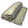
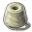

# Shared Anno 1800 Mods

Shared products from Kurila and Lrds42.

You are free to include shared products, as long as you don't modify the mods themselves.

## Shared Products

Contains products with definition, icon and Docklands information.

Icon | GUID | Name |
---|---|---|
 | 1404422300 | Cattle |
 | 1404420030 | Cherries |
 | 1500020000 | Wool Fabric |
 | 1500020010 | Sewing Thread |
 | 1500300000 | Barrels |

### Use Products in your Mod

Add the following dependencies to your `modinfo.json`:
```json
"ModDependencies": [
  "https://github.com/Qurila/anno1800-shared-extended-products/releases/download/v1.0.1/shared-extended-products-kurila.zip",
]
```

Products are not unlocked automatically, you need to unlock them yourself, if you use the products.

## How to Build

### Build with Visual Studio Code plugin

The mods are made with the [Modding Tools for Anno](https://marketplace.visualstudio.com/items?itemName=JakobHarder.anno-modding-tools) extension for [VS Code](https://code.visualstudio.com/).

Make sure to set `annoMods` settings.

Install the plugin, open a mod folder and press `F1` and choose `Build Anno Mod` or right click on a `modinfo.json` file.

### Build with Node.js

Run the following commands:

```
npm install .
npm run build
npm run package
```
